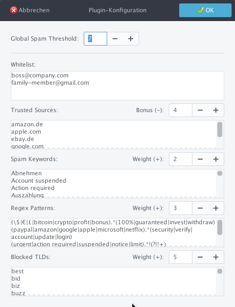

# Advanced Spam Filter Ultra for Mailnag (v4.5)

An enhanced, granular weighted spam filtering plugin for **Mailnag**. This plugin allows you to suppress unwanted email notifications using a multi-layered scoring system based on Keywords, Regular Expressions (Regex), and Top-Level Domains (TLDs). It features a priority Whitelist, an immediate "Infra Spam" block, and a dedicated Brand Protection system.

## ✨ Features

### Seven-Layer Filtering
* **Whitelist:** A priority list for specific senders or domains. Matches here bypass all subsequent filtering logic.
* **Infra Spam (Always Block):** Hard-blocks known spam infrastructure patterns (e.g., `deliverypro`, `privatedns.org`) immediately without requiring a score.
* **Brand Protection:** Detects display-name spoofing. If a mail claims to be from a protected brand (e.g., Telekom, Amazon) but uses an unauthorized domain, the **Regex Weight** is added to the total score.
* **Threshold:** Adjustable global score limit (Default: 5). If the final score is greater than or equal to this threshold, the notification is filtered.
* **Trusted Sources (Bonus):** Reduces the spam score for known safe contacts. Full email address matches reduce the score by **double** the bonus value compared to domain matches.
* **Keywords:** Scans name, subject, and body. Unique hits in the **subject line count double** the configured weight.
* **Regex Patterns:** Advanced pattern matching for names, addresses, subjects, or bodies. Matches in the **subject line count double**.
* **TLD Blocker:** Adds the **TLD Weight** if the sender's domain ends in a blacklisted extension (e.g., `.xyz`).

### User Interface

### Technical Highlights
* **Dynamic Scoring:** Every category has adjustable weights, allowing for "Soft-Filters" or "Hard-Blocks".
* **Smart-Split Logic:** Correctly handles complex Regex patterns (like `{4,10}`) without breaking at commas.
* **Automated Hygiene:** Automatically trims, deduplicates, and sorts input lists upon saving.
* **Presets:** Includes quick-select profiles for High (Aggressive), Medium (Default), and Low (Relaxed) filtering.

---

## 🚀 Installation

1. Copy `spamfilterplugin.py` to your Mailnag plugins directory:
   * **Local:** `~/.local/share/mailnag/plugins/`
   * **System-wide:** `/usr/lib/python3/dist-packages/Mailnag/plugins/`
2. Restart the Mailnag daemon.
3. Enable **Advanced Spam Filter Ultra** in the Mailnag configuration window (`mailnag-config`).

---

## ⚙️ Configuration Weights (GUI Defaults)

| Category | Default | Direction | Description |
| :--- | :---: | :---: | :--- |
| **Threshold** | 5 | **Limit** | Total score required to block a notification. |
| **Trusted** | 4 | **(-)** | Subtracts from score (Emails = 2x, Domains = 1x). |
| **Keywords** | 2 | **(+)** | Points per unique keyword (Subject = 2x weight). |
| **Regex** | 3 | **(+)** | Points per pattern match (Subject = 2x weight). |
| **TLDs** | 5 | **(+)** | Points if the domain extension matches. |

---

### Requirements
* **Mailnag**
* **Python 3**
* **Gtk 3.0**
